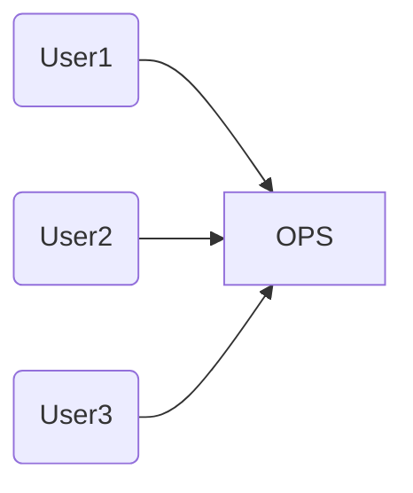

## 인터페이스 분리 원칙 (ISP, Interface Seperation Principle)

```
인터페이스를 분리해야 한다
```

### 모듈 수준



- 위 상황에서 User1,2,3 는 각각 OPS의 일부분만을 사용한다
    - 즉, 전혀 사용하고 있는 않은 코드에 의존하게 된다
- 위 문제는 인터페이스 단위로 분리하여 해결할 수 있다
  ```mermaid
    graph LR
      A(User1) --> D[U1Ops]
      B(User2) --> E[U2Ops]
      C(User3) --> F[U3Ops]
      G(OPS) --> D
      G(OPS) --> E
      G(OPS) --> F
  ```
## 결론
- Tool에 관한 것이다, 나머지 원칙을 지키는 HOW를 만들 때 이걸 써봐라
- 거꾸로 생각 하면 편하다
  - 인터페이스를 분리하지 않아도 되는 경우는 언제인가?
    - A클래스가 B인터페이스에 있는 모든 것을 구현 하고 실제로 필요한 경우
    - A클래스가 B클래스를 사용하고 있는데 A클래스가 B클래스의 모든 것을 사용하고 있는 경우
    - 즉, A클래스와 B클래스 '의존성'관계가 명확한 경우이다
    - `다시 말하면 인터페이스 분리 원칙은 '의존성'을 지키기 위한 도구이다`

### 아키텍처 수준

## CRP : 공통 재사용 원칙 (Common Reuse Principle)

- `컴포넌트 사용자들이 필요하지 않은 것에 의존하게 강요하지 말라`
- 공통 재사용 원칙도 클래스와 모듈을 어느 컴포넌트에 위치시킬지 결정할때 도움되는 원칙이다
- CRP에서는 같이 재사용되는 경향이 있는 클래스와 모듈들을 같은 컴포넌트에 포함해야 한다라고 말한다
    - 이런 컴포넌트 내부에서는 클래스들 사이에 수많은 의존성이 있으리라고 예상할 수 있다
- CRP는 각 컴포넌트에 어떤 클래스들을 포함시켜야 하는지를 설명해준다 그런데 이게 전부가 이니다 &rarr; CRP는 동일한 컴포넌트로 묶어서는 안되는 클래스가 무엇인지도 말해준다

- `컴포넌트 A가 컴포넌트 B의 하나의 클래스만 사용하더라도 의존성은 조금도 약해지지 않는다 &rarr; 컴포넌트 끼리는 여전히 의존관계이다`
    - 이 같은 의존성으로 인해 사용되는 컴포넌트가 변경될 때마다 사용하는 컴포넌트도 변경해야 할 가능성이 높다
    - 따라서 의존하는 컴포넌트가 있다면 해당 컴포넌트의 모든 클래스에 대해 의존함을 확실히 인지해야 한다
    - 바꿔 말하면 한 컴포넌트에 속한 클래스들은 더 작게 그룹지을 수 없다
        - 즉, 그중 일부 클래스에만 의존하고 다른 클래스와는 독립적일 수 없음을 확실히 인지 해야한다
- 따라서 CRP는 어떤 클래스를 한데 묶어도 되는지보다는, 어떤 클래스를 한데 묶어서는 안 되는지에 대해서 훨씬 더 많은 것을 이야기 한다
    - `CRP는 강하게 결합되지 않은 클래스들을 동일한 컴포넌트에 위치시켜서는 안된다고 말한다`
- ISP(인터페이스 분리 원칙)와의 관계
    - CRP는 인터페이스 분리원칙의 포괄적인 버전이다.
    - `ISP는 사용하지 않는 메서드가 있는 클래스에 의존하지 말라고 조언한다 CRP는 사용하지 않는 클래스를 가진 컴포넌트에 의존하지 말라고 조언한다`
    - `어잿든 둘다 필요하지 않은 것에 의존하지 말라!`


- 어렵다... 줄여서 말하면

### ISP와 아키텍처

- 일반적으로 필요 이상으로 많은 걸 포함하는 모듈에 의존하는 것은 해로운 일이다
- 시스템 S에서 프레임워크 F를 사용하려고하는데 프레임워크 F는 데이터베이스 D를 사용하고 있다
    - 위 경우 시스템 S에 전혀 필요하지 않은 데이터베이스 D의 기능이포함되게 된다
    - 데이터베이스D의 변경으로 인해 시스템 S를 수정해야하는 최악의 경우가 발생할 수 있다 

